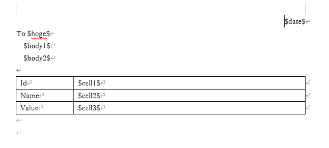
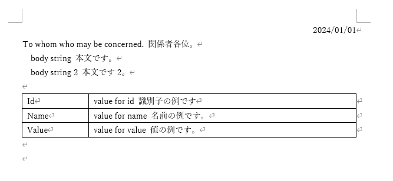

# Replace text in office files

Microsoft Officeなどの事務処理書類をテキストで管理したい、という人のためのCLIツールです。

組織内で回ってくる様々な書類は、入力欄が決まっている文章がほとんどです。入力が必要なのは表の中の一部だけ、ということもある。
このツールは、文字のサイズや位置の設定はWordに任せて、中の文字列だけをテキストファイルで管理するためのモノです。
テキストファイルはgitなどで管理すれば、複数人での共同編集も可能です。

This is a CLI tool for people who want to manage office-workers documents such as Microsoft Office in text format.

Most of the various documents that are used within an organization have predetermined input fields. Sometimes only a certain cell of a table requires input.
This tool allows you to leave the settings of font size and alignments to Word, and manage only the text strings inside with a text file.
If you manage the text files with git etc., multiple people can edit them together.

Wordファイルを用意して、値を代入したいところに```$body1$```の様に変数名を入れます。

Prepare a Word file and enter the variable name like ````$body1$```` where you want to assign the value.

- 代入前  


- 代入後  


# Requirements
- Python3
- python-docx, PyYAML
  - you can insatll them with pip.
  
```bash
$ pip3 install python-docx PyYAML
```


# Usage
代入したいWordファイルを用意して、値を代入したいところに```$body1$```の様に変数名を入れます。  
YAMLファイルに変数と値を記述します。
YAMLファイルは、拡張子が「.yaml」もしくは「.yml」のファイルで、中身はテキストファイルです。
任意のテキストエディターで編集できます。

Prepare the Word file you want to assign, and enter the variable name like ````$body1$```` where you want to assign the value.
Write the variables and values in the YAML file.
YAML file has the extension ".yaml" or ".yml" and the content is a text file.
It can be edited with any text editor.

```yaml
date: 2024/01/01
hoge : whom who may be concerned. 関係者各位。 
body1: body string 本文です。
body2: body string 2 本文です2。
cell1: value for id 識別子の例です
cell2: value for name 名前の例です。
cell3: value for value 値の例です。
```

CLIのpythonでスクリプトを動かします。
オプションの --inに用意したWordファイルを、--varに作成したYAMLファイルを指定します。 

Run the script using python on the CLI.
Specify the prepared Word file in option --in and the created YAML file in --var.

Example: Windowsの場合。DOSを使用します。
```bat
> python3 replacetext-docx.py --in=sample\template1.docx --var=sample\template1.yaml --out=out.docx
```

Example: Linuxの場合。
```bash
$ python replacetext-docx.py --in=sample/template1.docx --var=sample/template1.yaml --out=out.docx
```


現在のところ対応している yaml は、フラットなkey-valueペアだけです。yaml 要素の入れ子等は無理です。

