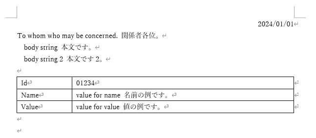

# Replace text in office files

Microsoft Officeなどの事務処理書類をテキストで管理したい、という人のためのCLIツールです。

組織内で回ってくる様々な書類は、入力欄が決まっている文章がほとんどです。入力が必要なのは表の中の一部だけ、ということもある。
文字のサイズや位置はWordに任せて、中の文字列だけをテキストファイルで管理し、gitなどで管理しながら共同編集を実行します。

Wordファイルを用意して、値を代入したいところに```$body1$```の様に変数名を入れます。
- 代入前  


- 代入後  


# Requirement
- Python3
- pipでpython-docxとPyYAMLをインストール

```bash
$ pip3 install python-docx PyYAML
```


# Usage
代入したいWordファイルを用意して、値を代入したいところに```$body1$```の様に変数名を入れます。  
YAMLファイルに変数と値を記述します。
```yaml
date: 2024/01/01
hoge : whom who may be concerned. 関係者各位。 
body1: body string 本文です。
body2: body string 2 本文です2。
cell1: value for id 識別子の例です
cell2: value for name 名前の例です。
cell3: value for value 値の例です。
```

CLIのpythonでスクリプトを指定して --template-docxにWordファイルを、--var-ymlにYAMLファイルを指定します。  


Example: Windowsの場合。
``` bash
> python doc-substitute.py --template-docx sample\template1.docx --var-yml sample\var-test.yml
```

Example: Linuxの場合。
``` bash
$ python doc-substitute.py --template-docx sample/template1.docx --var-yml sample/var-test.yml
```


- 代入前  


- 代入後  


現在のところ対応している yaml は、フラットなkey-valueペアだけです。yaml 要素の入れ子等は無理です。

